# Telco Demo Streaming 
Stetup Guide 0.1 
Date Oct 11th 2022
Author: frothkoetter 

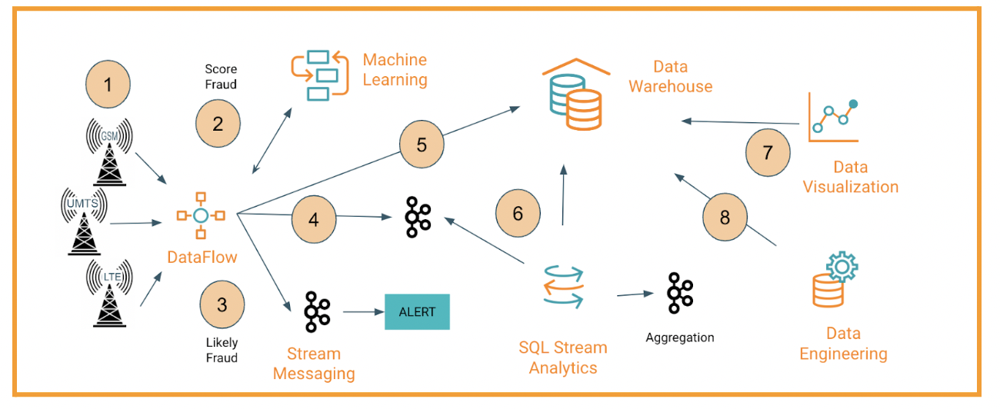

### What the demo shows:

* Generate and Ingest Tower Events for GSM, UMTS and LTE
* Add the score form ML Model API 
* Route Events to a fraud topic 
* Convert raw events into JSON format and move to _json Topic
* Move raw data to Cloud Storage 
* Continues Query, aggregations and Join static with stream
* Visualize the data in a map
* Data Partitioning with with Iceberg and job management

Requirement CDP PC DataHub Cluster: NIFI, KAFKA and FLINK and Kudu

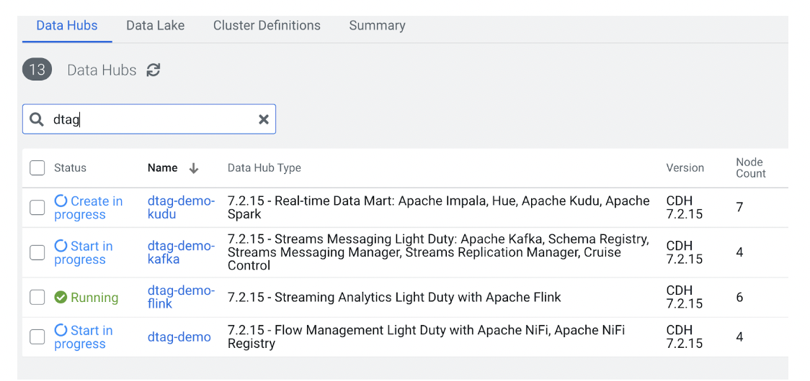

Creation takes approximately 2 Hrs. - shutdown daily and startup time is approx 10 - 20 minutes and require startup of data generation after shutdown.

Data Services: CML, CDE, CDW and CDF 


## Configure Nifi for DataGeneration and Routing

The Nifi flow in the UI 

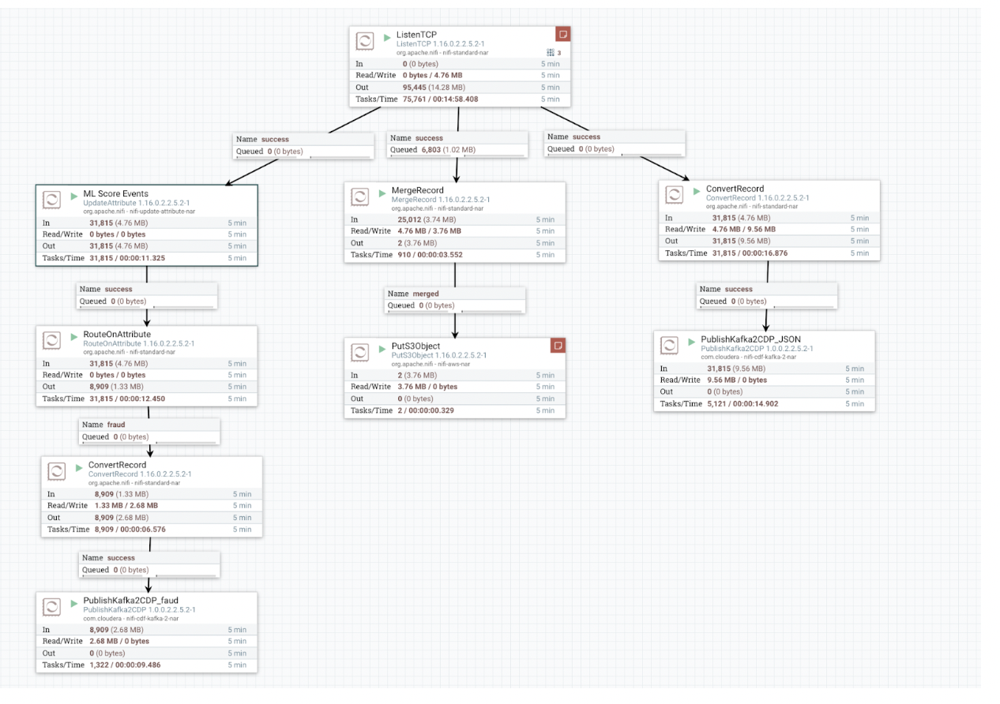

Upoad the FlowFile: `HubDevDemo.json` as template an import
(not using of FlowRegistry) 

Confiure processors 

`PutS3Object` - with Bucket location and AWS credentials 

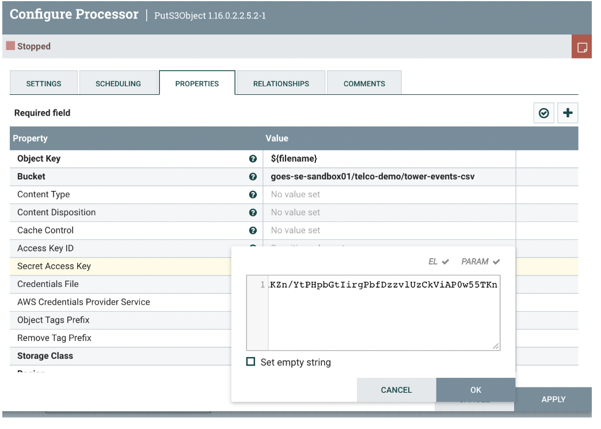

Create in AWS the directory and check later that data is stored in the location.

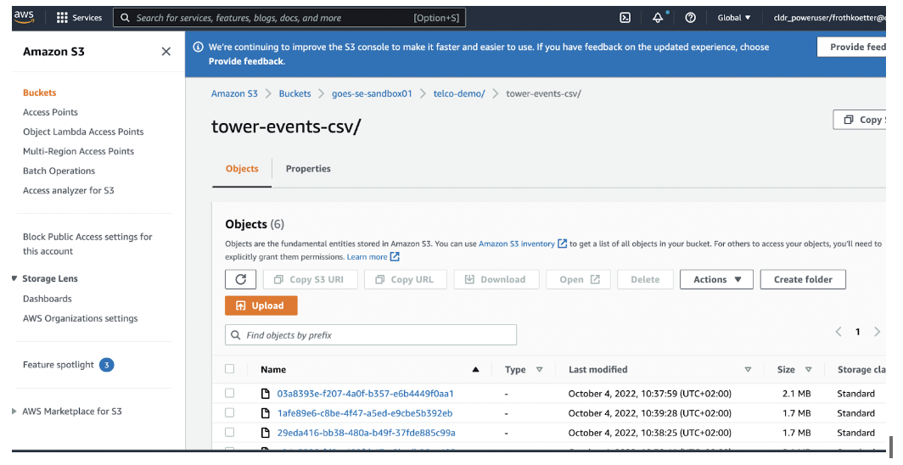

Configure the two `PublishKafka2CDP_fraud` and `PublishKafka2CDP_json`  procesors Broker and Topic

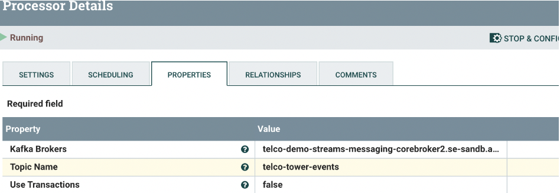

and user/pwd - use CDP workloaduser and pwd

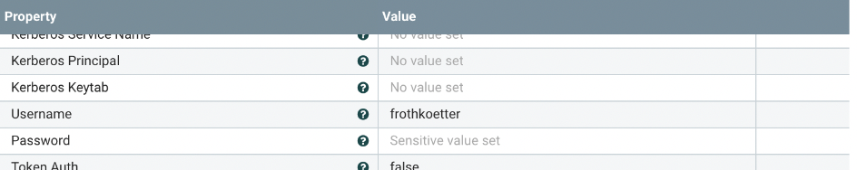

Check the SSL services running. 


## Telco tower event generator

Copy or clone the repo to your local machine and `scp` to a NIFI worker node

`scp -r ./* frothkoetter@telco-demo-streaming-nifi-nifi0.se-sandb.a465-9q4k.cloudera.site:/home/frothkoetter
`
Login to the NIFI worker Node you copied the repo

`ssh frothkoetter@telco-demo-streaming-nifi-nifi0.se-sandb.a465-9q4k.cloudera.site
`

Install python lib on the NIFI worker you connected: 

```
pip3 install faker
pip3 install psutils
pip3 install numpy
pip3 install pandas
```

Unzip cell-tower.csv 

` gunzip cell-tower.csv.gz`

Adjust `gen.sh` script to your location and datasets of cell-towers. 

```
#!/bin/sh

host=telco-demo-events-nifi2

while [ 1 ]
do
 python3 gen-events.py -nc 1 -iso 'be' -state 'Antwerp' -r 'LTE' -ne 1000 -nd '1m' -f 'cell-tower.csv'
 python3 gen-events.py -nc 1 -iso 'be' -state 'Antwerp' -r 'UMTS' -ne 400 -nd '1m' -f 'cell-tower.csv' 
 python3 gen-events.py -nc 1 -iso 'be' -state 'Antwerp' -r 'GSM' -ne 600 -nd '1m' -f 'cell-tower.csv'
 sleep 50
done
```
This configuration generates approx 2000 events/minute 

Startup: 
 
`nohup ./gen.sh | nc telco-demo-events-nifi2 31888 & `

The events are send into a linux pipe on port 31888, that NIFI is listening to. Check events coming in Nifi UI 

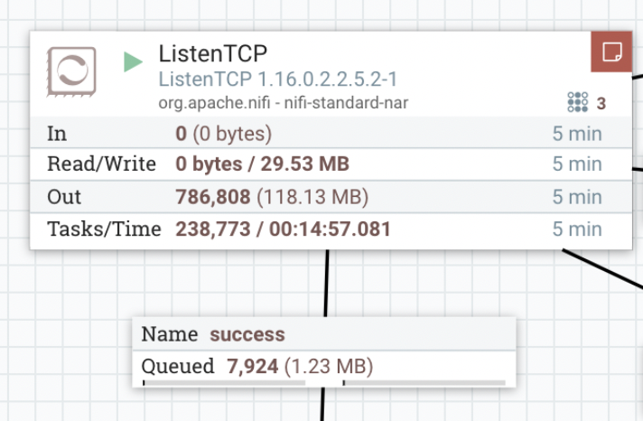

## Prepare Messaging (Kafka) Cluster

Go to SMM and create topics (delete policy)

```
telco_tower_events_json
telco_tower_events_5min_json 
telco_tower_events_scored_json
```

Watch events coming into topics and recordconverter writing to the Kafka topics.

(check that the first character of the payload is NOT a [ : if yes then the NIFI RecordConverter JsonRecordWriter Service need to be configured correct) 

## Configure SQL Streams Builder (SSB) 

Download CDP keytab from your profile and upload your keytab File to SSB 

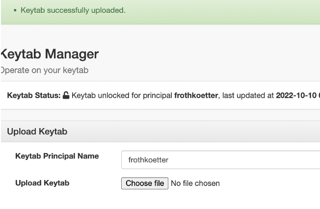

Define the DataProvider for Kafka  

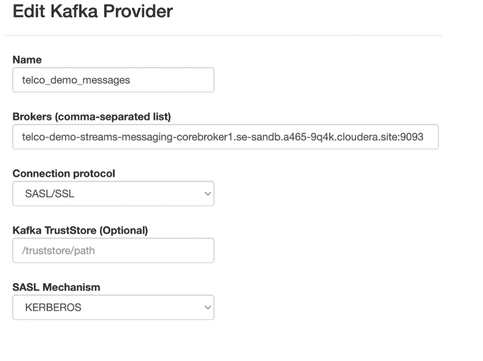

Next is to define the table, copy past the topic definition or try detect schema feature

```JSON
{
   "namespace": "example.avro",
   "type": "record",
   "name": "telco_events",
   "fields": [
      {"name": "event_id", "type": "string"},
      {"name": "imsi", "type": "string"},
      {"name": "start_time", "type": "string"},
      {"name": "up_time", "type": "string"},
      {"name": "cell", "type": "string"},
      {"name": "disconnect", "type": "string"},
      {"name": "drop_call", "type": "string"},
      {"name": "radio", "type": "string"},
      {"name": "mcc", "type": "string"},
      {"name": "net", "type": "string"},
      {"name": "area", "type": "string"},
      {"name": "long", "type": "string"},  
      {"name": "lat", "type": "string"},      
     {"name": "ingestion_dt", "type": "string"}   
   ] 
 }
```
You should see the column definition in the left window

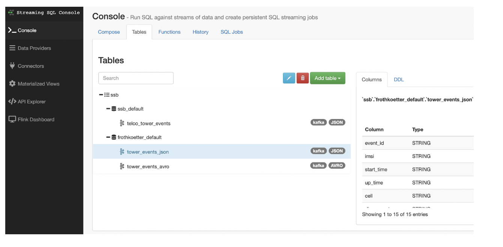


## Run SQL Queries in SSB

### Query 1 - events grouped by network and dropped call over a tumbling window

```SQL
select 
 radio,
 drop_call, 
 count(1) anz_events,
 TUMBLE_END( eventTimestamp, INTERVAL '15' MINUTE) AS window_end_timestamp 
from 
 telco_tower_events 
where
 eventTimestamp > cast( current_timestamp - INTERVAL '3' HOUR  as timestamp)
group by 
 TUMBLE( eventTimestamp, INTERVAL '15' MINUTE), radio, drop_call
```

Results


> `radio
> drop_call
> anz_events
> window_end_timestamp
> `


"GSM"
"True"
58732
"2022-10-05T10:45"
"GSM"
"True"
90323
"2022-10-05T11:00"
"UMTS"
"False"
102968
"2022-10-05T11:15"
"GSM"
"False"
85762
"2022-10-05T11:30"
"LTE"
"False"
58493
"2022-10-05T11:45"
"GSM"
"True"
89216
"2022-10-05T12:00"


### Query 2: IMSI with >= 10 Dropped Calls over a SLIDING window  

```SQL
select cast( HOP_END( A.eventTimestamp, INTERVAL '5' MINUTE, INTERVAL '15' MINUTES)  as VARCHAR) AS window_end_timestamp ,
   A.imsi, count(* )as dropped_calls 
from  `ssb`.`ssb_default`.`telco_tower_events` A
where 
  drop_call = 'True'
group by 
 A.imsi ,
 HOP( A.eventTimestamp, INTERVAL '5' MINUTE, INTERVAL '15' MINUTE)
having count(* ) >= 10
```

Results
> window_end_timestamp
> imsi
> dropped_calls


"2022-10-10 07:25:00.000"
"643585455"
15
"2022-10-10 07:35:00.000"
"398120570"
37
"2022-10-10 07:45:00.000"
"579631667"
37
"2022-10-10 07:55:00.000"
"874820217"
25


## Store 5 min averages into Kafka Sink

If not done before create in SMM topic : telco_tower_events_5min_json 


!SSB Table create a schema collection : cleanup policy delete

Copy this schema:

```JSON
{
   "namespace": "example.avro",
   "type": "record",
   "name": "telco_events_5min_json",
   "fields": [
      {"name": "window_end_timestamp", "type": "string"},
      {"name": "radio", "type": "string"},
      {"name": "net", "type": "string"},
      {"name": "area", "type": "string"},
      {"name": "drop_call", "type": "string"},
      {"name": "cnt_events", "type": "string"}
   ] 
 }
```

Create a table telco_tower_events_5min_json

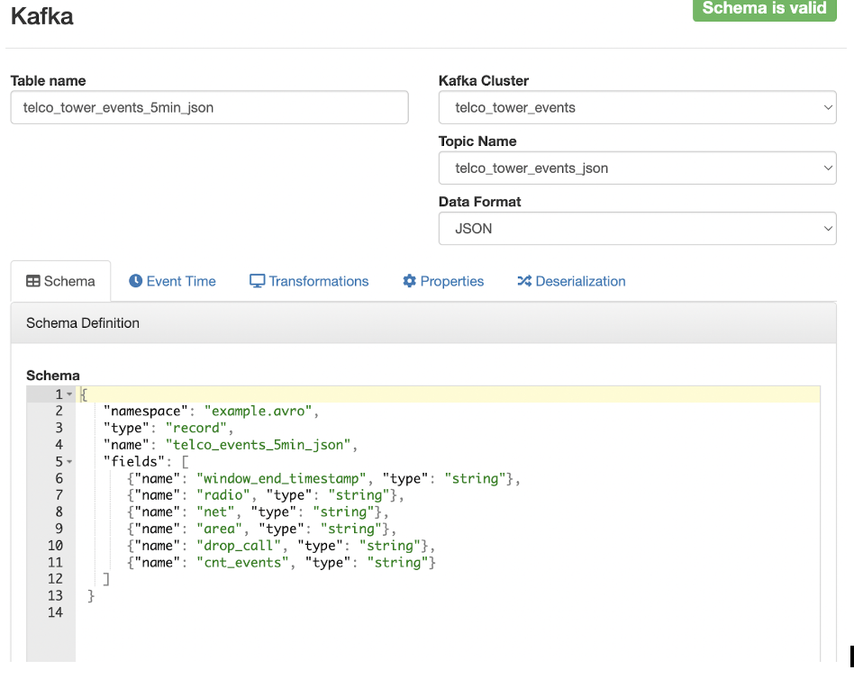


Enter in the console window:

```SQL
insert into telco_tower_events_5min_json 
select 
 cast( TUMBLE_END( eventTimestamp, INTERVAL '15' MINUTE) as VARCHAR) AS window_end_timestamp ,
 radio,net,area,drop_call, 
 cast(count(1) as VARCHAR) as cnt_events,
 cast(current_timestamp as TIMESTAMP)
from 
 telco_tower_events 
group by radio,net,area,drop_call, 
 TUMBLE( eventTimestamp, INTERVAL '15' MINUTE)
```

## Adding KUDU table to SSB
Allow Ranger Permissions on KUDU (add user to the allow)
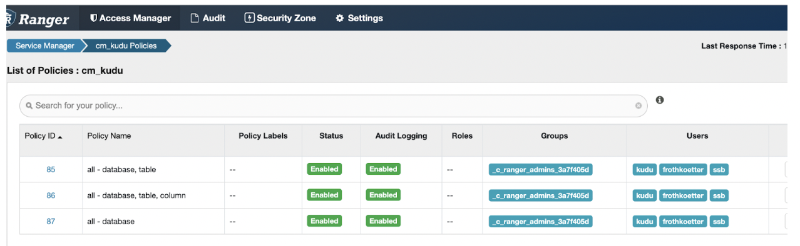

Upload the file `mcc_mnc_international.parq` to the S3 location.

`/goes-se-sandbox01/telco-demo/mcc_mnc_international/mcc_mnc_international.parq`

Go to Kudu HUE and create a table: 

```SQL 
DROP TABLE if exists mcc_mnc_international;
CREATE EXTERNAL TABLE mcc_mnc_international (
mcc INT,
mcc_int INT,
mnc INT,
mnc_int INT,
iso STRING,
country STRING,
country_code INT,
networks STRING
)
ROW FORMAT DELIMITED FIELDS TERMINATED BY ','
LOCATION 's3a://goes-se-sandbox01/telco-demo/mcc_mnc_international';
```
Check you can access and get results

```SQL
select * from mcc_mnc_international;
```

Create the Kudu table and check that data is available

```SQL
Drop table if exists mcc_mnc_international_kudu;
create table mcc_mnc_international_kudu (
mcc INT,
mnc INT,
iso STRING,
country STRING,
country_code INT,
networks STRING,
primary key( mcc, mnc))
stored as kudu;

insert into mcc_mnc_international_kudu
select mcc, mnc,iso, country, country_code, networks 
from mcc_mnc_international;

select * from mcc_mnc_international_kudu
```

Go back to SSB Console and add KUDU to the Catalog 

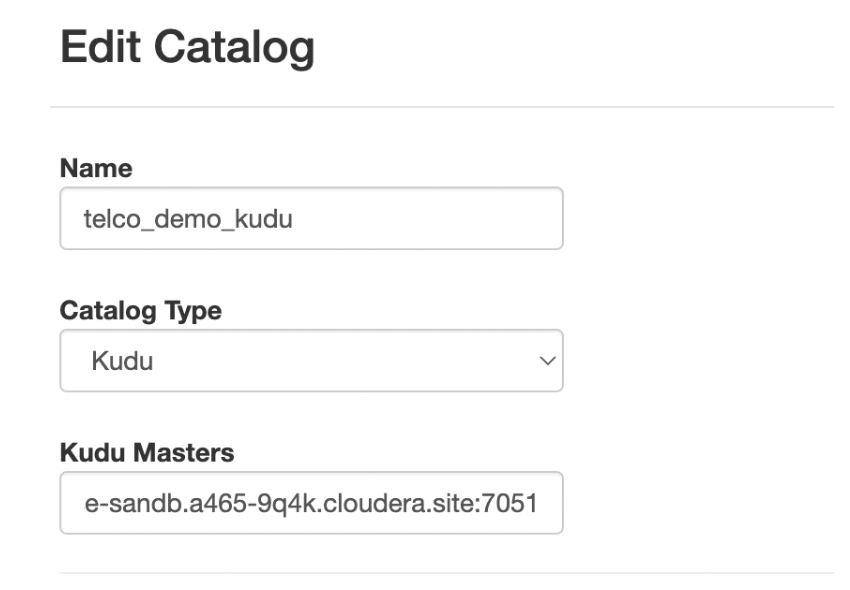

If connection is working the KUDU tables can be added

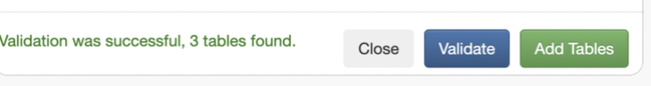

You can check that in the console table view

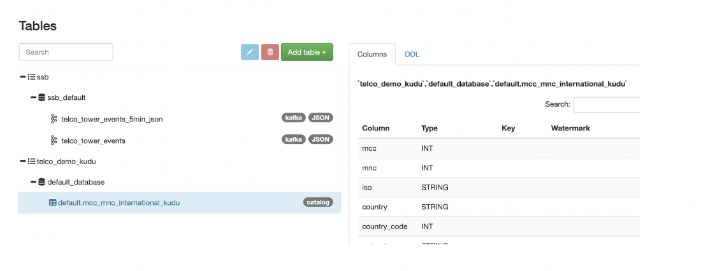

Now you ready to access the KUDU table in SSB.

### Query 3 - join two tables 

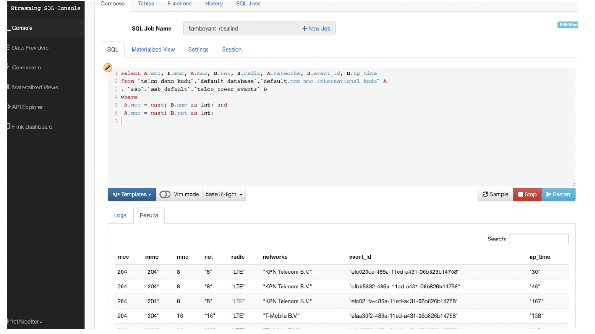


Go to SSB console and run the SQL command 
 
```SQL
select A.mcc, B.mmc, A.mnc, B.net, B.radio, A.networks, B.event_id, B.up_time
from `telco_demo_kudu`.`default_database`.`default.mcc_mnc_international_kudu` A
, `ssb`.`ssb_default`.`telco_tower_events` B
where 
 A.mcc = cast( B.mmc as int) and
 A.mnc = cast( B.net as int) 
```
### Results 

`mcc
mmc
mnc
net
radio
networks
event_id
up_time
`


`204
"204"
8
"8"
"LTE"
"KPN Telecom B.V."
"efbb5832-486a-11ed-a431-06b826b14758"
"46"
`
`204
"204"
8
"8"
"LTE"
"KPN Telecom B.V."
"efc021fa-486a-11ed-a431-06b826b14758"
"167"`
`204
"204"
16
"16"
"LTE"
"T-Mobile B.V."
"efaa30f2-486a-11ed-a431-06b826b14758"
"138"`


### Query 4 - Join two tables over a tumbling window

```SQL
select cast( TUMBLE_END( B.eventTimestamp, INTERVAL '15' MINUTE) as VARCHAR) AS window_end_timestamp ,
   A.networks, sum(cast( B.up_time as int) ) 
from `telco_demo_kudu`.`default_database`.`default.mcc_mnc_international_kudu` A
, `ssb`.`ssb_default`.`telco_tower_events` B
where 
 A.mcc = cast( B.mmc as int) and
 A.mnc = cast( B.net as int) 
group by 
 A.networks, 
 TUMBLE( B.eventTimestamp, INTERVAL '15' MINUTE)
```

### Results

`
window_end_timestamp
networks
EXPR$2
`


`"2022-10-10 07:15:00.000"
"KPN Telecom B.V."
30356`
`"2022-10-10 07:15:00.000"
"T-Mobile B.V."
8402`
`"2022-10-10 07:15:00.000"
"Vodafone Libertel"
31190`
`"2022-10-10 07:15:00.000"
"Tele2"
14387`
`"2022-10-10 07:30:00.000"
"Vodafone Libertel"
9532414`


## Virtual Warehouse and Data Visualization

Create a xsmall Hive CDW on the Environment, open Hue

Create a database:  `telco_demo_streaming`

Create external table:

```SQL
drop table if exists event_cell_towers;
CREATE EXTERNAL TABLE IF NOT EXISTS event_cell_towers (
event_id STRING COMMENT 'cell tower uniq event id',
imsi BIGINT COMMENT 'international mobile subscriber identity',
start_time TIMESTAMP COMMENT 'event captured start time' ,
up_time INT COMMENT 'event up time in second', 
cell_id  INT COMMENT 'cell Tower uniq_id',
disconnect BOOLEAN COMMENT '1=event triggered a disconnect 0=event lost',
drop_call BOOLEAN  COMMENT '1=call dropped from tower 0=call terminated/transfered',
radio STRING COMMENT 'The generation of broadband cellular network technology',
mcc INT COMMENT 'Mobile Country Code',
net INT COMMENT 'Network',
area INT,
lon DOUBLE COMMENT 'longitude coordinate',
lat DOUBLE COMMENT 'latitude coordinate'
)
ROW FORMAT DELIMITED FIELDS TERMINATED BY ','
LOCATION '/telco-demo/tower-events-csv'
;
```

Check you have have access and data available

```SQL
select * FROM event_cell_towers limit 10;
```

Create an table in iceberg table format and partitioned by a day

```SQL
create table event_cell_towers_ice (
 event_id STRING COMMENT 'cell tower uniq event id',
imsi BIGINT COMMENT 'international mobile subscriber identity',
start_time TIMESTAMP COMMENT 'event captured start time' ,
up_time INT COMMENT 'event up time in second', 
cell_id  INT COMMENT 'cell Tower uniq_id',
disconnect BOOLEAN COMMENT '1=event triggered a disconnect 0=event lost',
drop_call BOOLEAN  COMMENT '1=call dropped from tower 0=call terminated/transfered',
radio STRING COMMENT 'The generation of broadband cellular network technology',
mcc INT COMMENT 'Mobile Country Code',
net INT COMMENT 'Network',
area INT,
lon DOUBLE COMMENT 'longitude coordinate',
lat DOUBLE COMMENT 'latitude coordinate'
) partitioned by (tag bigint) 
stored by iceberg;
```

Start the initial insert: 

```SQL
insert into event_cell_towers_ice
select 
event_id,
imsi,
start_time ,
up_time , 
cell_id ,
disconnect ,
drop_call,
radio ,
mcc ,
net,
area ,
lon,
lat,
cast(from_unixtime(unix_timestamp(start_time),'yyyyMMdd') as bigint) as tag
from event_cell_towers
where event_id <> 'event_id';
```


Wait a few minutes and alter the partition schema and run the next INSERT.

```SQL
ALTER TABLE event_cell_towers_ice 
 SET PARTITION SPEC(tag, hours(start_time) );
```


```SQL
insert into event_cell_towers_ice
select 
event_id,
imsi,
start_time ,
up_time , 
cell_id ,
disconnect ,
drop_call,
radio ,
mcc ,
net,
area ,
lon,
lat,
cast(from_unixtime(unix_timestamp(start_time),'yyyyMMdd') as bigint) as tag
from event_cell_towers
where event_id <> 'event_id'
and start_time > (select max(start_time) from event_cell_towers_ice);
```

Check the snapshots

```SQL
select * from telco_demo_streaming.event_cell_towers_ice.history;
```

Check the number of files

```SQL
describe formatted event_cell_towers_ice
```

## Data Vizualisation 


Create a token at MapBox.com (free of charge)

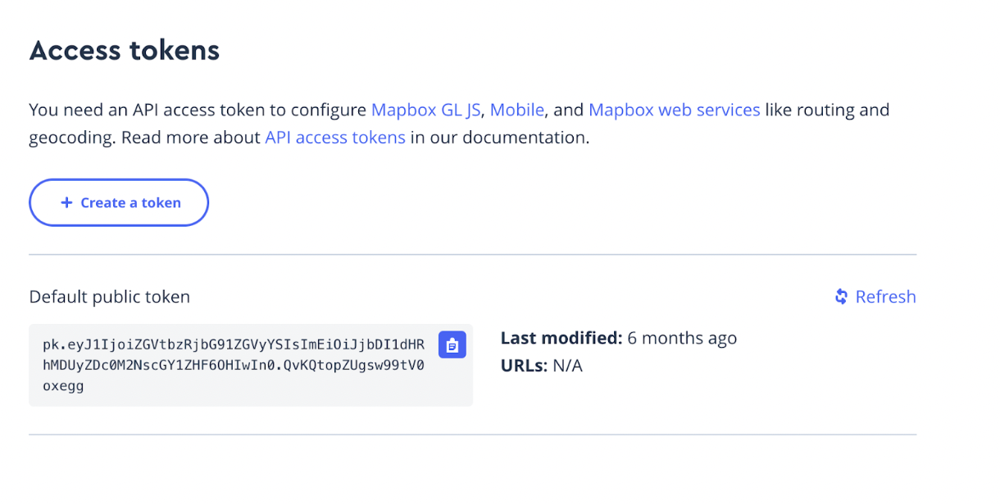

Copy the token

Create in CDW a DataViz instance and open DataViz application

Paste the MapBox token into the site settings and scrol down: 

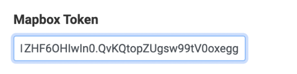

Save the configuration and add a connection to the CDW virtual warehouse add the data source for the table `telco_demo_streaming.event_cell_towers_ice` and create a visual fir an interactive map . here with geo - locations 

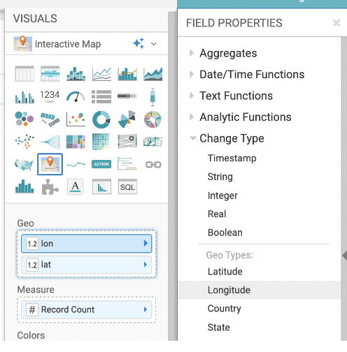

The report should look like this:

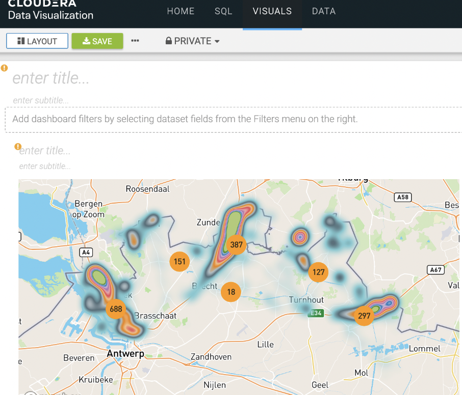

## Data Service Data Engineering

Create a small virtual Cluster and download or update cde cli executeable and configuration on your local machine

`vi ~/.cde/config.yaml `

set the CDE cluster endpoint (copy from CDE UI) 

```
user: frothkoetter 
vcluster-endpoint: https://jn9mlf2v.cde-t7w5wnhc.se-sandb.a465-9q4k.cloudera.site/dex/api/v1 
```

Add cdw connection to Airflow - Virtual Cluster UI - Airflow UI 


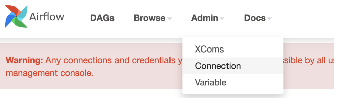

Enter the required settings for the connection configuration i.e. 

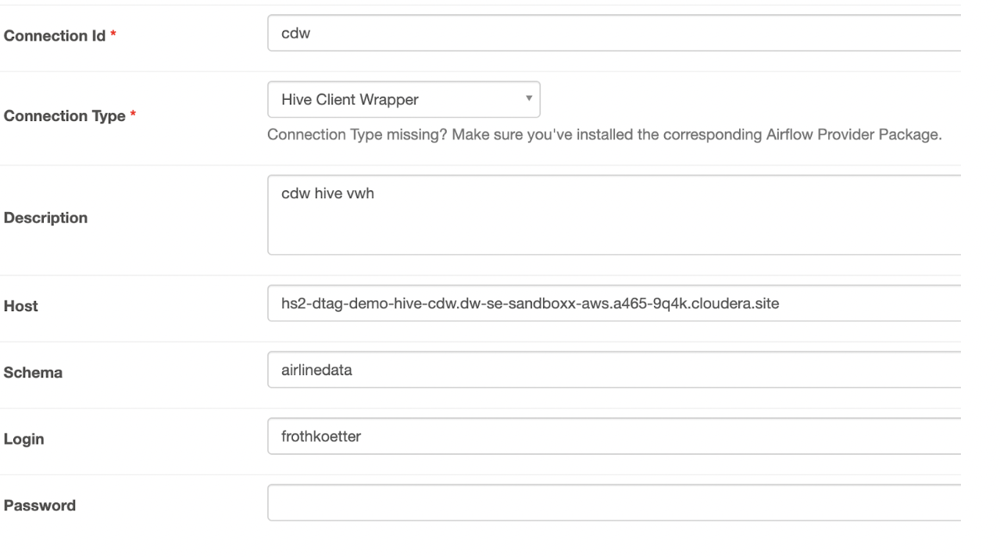

On your local machinge create Airflow DAG file: `cdw-ice-dag.py`

```
from airflow import DAG
from datetime import datetime, timedelta
from cloudera.cdp.airflow.operators.cdw_operator import CDWOperator
from cloudera.cdp.airflow.operators.cde_operator import CDEJobRunOperator
from airflow.operators.dummy_operator import DummyOperator

default_args = {
    'owner': 'frothkoetter',
    'depends_on_past': False,
    'email': ['frothkoetter@cloudera.com'],
    'start_date': datetime(2021,1,1,1),
    'email_on_failure': False,
    'email_on_retry': False,
    'retries': 0,
    'retry_delay': timedelta(minutes=5)
}

dag = DAG(
    'cdw-ice-dag', default_args=default_args, catchup=False, schedule_interval="0,10,20,30,40,50 * * * *", is_paused_upon_creation=False)

vw_pre_check = """
select max(start_time) from dtag_demo.event_cell_towers_ice;
select * from dtag_demo.event_cell_towers_ice.history;
"""

vw_upsert = """
insert into dtag_demo.event_cell_towers_ice
select event_id, imsi, start_time , up_time , cell_id , disconnect , drop_call, radio , mcc , net, area , lon, lat, cast(from_unixtime(unix_timestamp(start_time),'yyyyMMdd') as bigint) as tag
 from dtag_demo.event_cell_towers
 where event_id <> 'event_id'
and start_time > (select max(start_time) from dtag_demo.event_cell_towers_ice);
"""

vw_post_check = """
select max(start_time) from dtag_demo.event_cell_towers_ice;
select * from dtag_demo.event_cell_towers_ice.history;
"""

start = DummyOperator(task_id='start', dag=dag)

cdw_cleanup = CDWOperator(
    task_id='cdw-cleanup',
    dag=dag,
    cli_conn_id='cdw',
    hql=vw_pre_check,
    schema='dtag_demo',
    use_proxy_user=False,
    query_isolation=True

)

cdw_upsert = CDWOperator(
    task_id='cdw-upsert',
    dag=dag,
    cli_conn_id='cdw',
    hql=vw_upsert,
    schema='dtag_demo',
    use_proxy_user=False,
    query_isolation=True

)

cdw_post = CDWOperator(
    task_id='cdw-post',
    dag=dag,
    cli_conn_id='cdw',
    hql=vw_post_check,
    schema='dtag_demo',
    use_proxy_user=False,
    query_isolation=True

)
end = DummyOperator(task_id='end', dag=dag)

start >> cdw_cleanup >> cdw_upsert >>  cdw_post >> end
```


Run the following CMDs from the CDE CLI
 
```sh
./cde resource create --name cdw-ice-dag
```
(note: first time you will be promted to enter the workload password)

```sh
./cde resource upload --name cdw-ice-dag --local-path cdw-ice-dag.py
```

```sh
./cde job create --name cdw-ice-dag-job --type airflow --dag-file cdw-ice-dag.py  --mount-1-resource cdw-ice-dag 
```

Check in CDE virtual cluster UI that the Job is created and started, … 


The job will runtime is approx 2 minutes and is scheduled to run every 10 minutes. 

 


